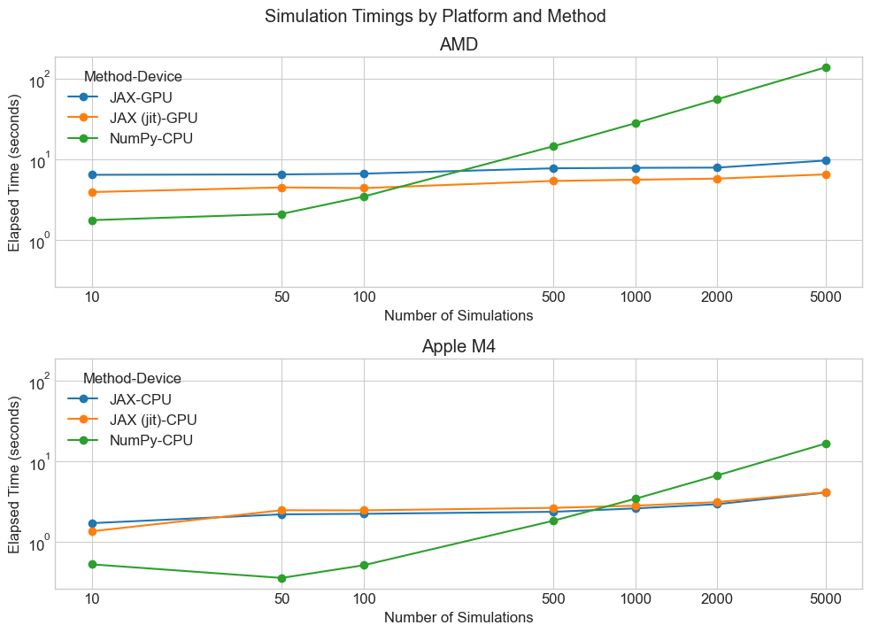

# Introduction

I have implemented a small simulation framework in Python that takes arbitrary
user functions written with Numpy or JAX and manages simulation outputs. The 
package mainly deals with reproducibility through explicit randomization, 
data file storage and caching, method comparison and evaluation, and has 
limited visualization capabilities.

## Motivation

Simulation studies often come with a lot of boilerplate code that can be shared
across projects. R packages like `simChef` and `simulator` provide functionality
to handle this, but Python lacks similar tools. This package aims to fill that
gap in a Pythonic manner. To that end, I have decided to follow a few design
principles that hopefully make the package simple to use and familiar to Python
users.

The main beneficiaries of the package are users who are conducting simulation
studies in JAX. Most of the package's special implementations are built
around this framework, though users may supply `numpy` functions. However,
these `numpy` functions generally won't benefit from exceptional speedup
under this version of the package, simply due to limitations around broadcasting
that will explored a bit later.


# Description

The simluation framework (so far untitled formally) consists of components
that roughly align with thir R counterparts:

1) Data Generating Processes (DGPs)
2) Methods
3) Evaluators
4) Plotters

## Architecture

These system components are tied together with the `run_simulations` function,
which is invoked through a relatively simple mapping of functions with a 
dictionary of parameters. Users of `scikit-learn` should find the structure eminently familiar.

```python

### example usage
data, methods, evaluations, plots = run_simulations(
    key,
    dgp_mapping=[
        (
            data_fn,
            {
                "n": [100, 200],
                "p": [5, 10, 20, 50],
                "dist": ["normal", "t"],
            },
        )
    ],
    method_mapping=[
        (method_fn, {"alpha": [0.01, 0.1, 0.5, 1.0, 2.0]}),
    ],
    evaluators=[rmse, bias, mae],
    plotters=[
        (
            rmse,
            create_plotter_fn(
                x="p",
                hue="method",
                col="dist",
                plot_class=sns.lineplot,
            ),
        ),
        (
            bias,
            create_plotter_fn(
                x="method",
                col="p",
                row="n",
                plot_class=sns.barplot,
            ),
        ),
        (
            mae,
            create_plotter_fn(
                x="p",
                hue="method",
                col="dist",
                plot_class=sns.lineplot,
            ),
        ),
    ],
    targets=["beta"],
    n_sims=50,
    simulation_dir=tmpdir / "example",
)
```

To build this pipeline we have several helper functions the bridge between each
step, with the main goal being to "automatically" utilize the outputs of
one function as the input to another function through a meta-proramming 
decorator. In practice, this is a relatively simple affair that only
requires users to annotate their functions with the names of their outputs
and then utilize those same names for the inputs of methods.

For example, consider the following data generating process:

```python
@dgp(outputs=["X", "y", "beta"], label="LinearRegressionDGP")
def linear_regression_dgp(key, n, p, dist="normal"):
    """Generates data from a linear regression model."""
    key, subkey = jax.random.split(key)
    if dist == "normal":
        X = jax.random.normal(subkey, (n, p))
    elif dist == "t":
        X = jax.random.t(subkey, df=3, shape=(n, p))
    else:
        raise ValueError("Unsupported distribution")
    
    beta = jax.random.normal(key, (p,))
    y = X @ beta + jax.random.normal(key, (n,))
    
    return X, y, beta
```

This function runs the same as before, but the `@dgp` decorator denotes this
as a data generating process and encloses the output with a named tuple
containing each of the corresponding arguments. Then, this input is passed
to an appropriate method, such as

```python
@method(outputs="beta_hat", label="OLS")
def ols_regression(X, y):
    beta_hat = jnp.linalg.inv(X.T @ X) @ X.T @ y
    return beta_hat
```

## Vectorization

`JAX` has a powerful `vmap` API that allows us to arbitrarily and 
efficiently vectorize functions so that users do not have to worry about 
proper vectorization to the same degree. In fact, the main purpose of the 
package is to take the burden of managing replications of a data generating
process or method fitting and turn them into functions that vectorize over
a higher dimensional tensor object.

In this case, because we passed an argument of `n_sims=50` to the
`run_simulations` function, the package will utilize vmap to run
50 replications of the data generating process, save off the resulting data,
and then fit the method 50 times as well.

The evaluator does not have the same level of contract as the DGPs and methods
primarily because it is not necessary. I have implemented a few default
metrics that can be used, and fortunately, these JAX functions actually work
with `NumPy` arrays.

The primary method of vecotrization is batching `jax.vmap` over the leading 
index of "appropriate" arguments, and copying all others. This is surprisingly
powerful simplifying assumption that unfortunately limits the ability to apply
vectorization in `NumPy` to the same degree. For example, the data-generating
process above could be easily written in `NumPy` to simply generate a single, 
3D array of shape `(n_sims, n, p)`, but looping over the method fitting may still 
unavoiable; for arbitrary functions, it's difficult to know what
is and is not vectorizable and how to broadcast. 

The reality of JAX is that, at some level, you can get higher performance code
that is, if not sloppier, perhaps less elegant in an approach. You can write a
straightforward loop that iterates over replications that is slow for smaller 
batches, but for larger ones, you face extremely gradual returns to scale.

## Evaluation

For now, we have some simplifying API assumptions on the `Evaluator` class and
`evaluator` decorator, namely that the output of each evaluator is a scalar. 
This is not ideal, nor is it a requirement of the package. Because of JAX's
automatic vectorization in fact, `vmap` can return outputs
of arbitrary dimensions, even utilizing tuple collections in Python for
better organization of results. 

The evaluation results of the methods are stored in a `pandas.DataFrame` object,
and are invoked through the `evaluate_methods` function. This function takes
the outputs of the methods and data generating processes and computes 
evaluation metrics for the targets specified by the user.

Evaluators decide what to evaluate based soley on the output name provided by a 
method. Assuming the user names the output a variation of the "true" parameter
that is output by the data generating process (e.g., "beta" and "beta_hat"),
then the evaluator matches these two outputs and computes the requested
evaluation metrics.

## Plotting

Rudimentary plotting capabilities are included in the package through
the `create_plotter_fn` function. Notably, this component is missing a decorator
interface, but this is intentional; the plotting is arbitrary enough that
given a particular plotting function (e.g., `seaborn.lineplot`), and target,
users can effectively loop a plotter over different metrics. This specification
is best applied not during method construction or in the function signature,
but instead during evaluation. Arbitrary arguments are passed to `seaborn`'s 
`FacetGrid` class.

Users may create any callable function that takes a dataframe as its first 
argument, a target (as a string) as it's second, and an evaluation metric.
The latter two arguments mostly function for subsetting the results dataframe
for plotting.

```python

plotters=[
    (
        rmse,
        create_plotter_fn(
            x="p",
            hue="method",
            col="dist",
            plot_class=sns.lineplot,
        ),
    ),
    (
        bias,
        create_plotter_fn(
            x="method",
            col="p",
            row="n",
            plot_class=sns.barplot,
        ),
    ),
]
```

## Caching

The major beneefit the package gives is an "invisible" caching layer that 
prevents data recalculation or method refitting. The average Python user is
probably familiar with dictionaries, and so I added two dictionary classes
that save data when items are added to it. The `DataDict` class provides this
functionality for arbitrary Python objects and uses the `dill` library for 
serialization. The `ImageDict` class does the same, but specializes
in saving images. 

I chose `dill` as the serialization library because it stores code for 
generating the items alongside the items themselves. It is a slower serialization
library, but it more robust than `pickle` for saving arbitrary Python objects
because you do not need to have the exact same code imported in your scripts
when loading the data. This allows one to simply instantiate a `DataDict` 
pointing to a directory of previously saved data, and the items will be loaded.

# Results

There are clear advantages to using `NumPy` functions as opposed to `JAX`. To
begin, it is generally a package that users are more familiar with. Beyond
this simplification, there is no concept of `jit` compiliation, device
management, or as much of an emphasis on functional style, programming,
which can be disconcerting to new users. 

There are also clear timing issues - `JAX` is generally faster for larger
data sizes, but the overhead of compilation and device management means that
for smaller data sizes `NumPy` is often faster. Below are some timing results
for fitting a ridge regression model with varying data sizes and replications.



To achieve these timings, I ran the package on my home server, 
with an AMD cpu and an NVidia Geforce RTX 2060 GPU. The GPU is
showing its age, but still, the results demonstrate that after
only 100 replications of fitting the ridge regression model on 
each of 40 configurations, `JAX` is able to outperform `NumPy` fairly. 

More surprisingly, these returns to scale are still realized
on CPU alone, though the speedup is less pronounced. Using
my local laptop, I found that `JAX` began to outperform `NumPy`
after about 1000 replications of fitting the ridge regression
models. And most sadly of all, my home server is slower than my laptop, even with a GPU. 

Let's be clear - these results are based around fairly
subpar `NumPy` code for fitting ridge regression models, and 
in fact there may be a way to vectorize the function that would
nullify these speedups. To support arbitrary user functions, my `NumPy` loops over the first index dimension in a list comprehension. Yet, for cases when users are
writing arbitrary functions that may not be easily vectorizable,
or simply lack the knowledge to do so, this package
provides a gentle wrapper around `JAX` that allows faster
code execution with fairly minimal setup and familiar, Pythonic
style.

But regardless, the output of the simulation runs gives you a `pandas` data frame
and a set of amateurish (for now) plots that can summarize your results.


To run the demo yourself, you may run the file at `./example/ridge_example.py`.

# Lessons Learned

## Challenges

There were a myriad of challenges in getting this package together, listed as follows in no particular order: 
1) Figuring out how to store metadata on functions without disrupting their signatures or usability. The decorator pattern is powerful, but it can be tricky to keep it unintrusive.
2) Keeping the API contract light. The more requirements we place on users, the less likely they are to use the package. Striking a balance between flexibility and usability is difficult.
3) Avoid subclassing. Utilizing it adds several layers to end users.
4) Clean caching. It was incredibly difficult to ensure that simulations are not rerun unnecessarily. Parameters are easy enough to track, but I spent a significant amount of time figuring out the best way to store the key/seed used for the randomization process for reproducibility. The best way, I think, was to store the initial seed directly as part of the filepath. I include this option, as well as a key-hash style function that, to be honest, I'm not sure works all that well for JAX keys and certainly doesn't work for NumPy random states.
5) Vectorization. JAX's vmap is powerful, but I spent an inordinate amount of time figuring out how to generate a tuple of `0`'s and `None`'s that corresponded to the appropriate signature for the `in_args` argument.
6) I think the plotting is pretty lame right now, to be perfectly honest. It's fine, it outputs plots, but it doesn't actually make your life easier, just more reproducible, which is something, but I'd like to figure out how to make it do both.
7) Python's type hinting is incredibly annoying at times. I tried to use it extensively, but there are many cases where it's difficult to express what a function is taking in or outputting without being overly verbose. It makes your code more readable in theory, but in practice it is undermined slightly by Python's duck typing (after all, Python is dynamic so we don't have to worry so much about types).

## How the Approach Changed from the Course

The biggest change from the course was my gradual emphasis on testing and 
reproducibility. It was tempting to write code and keep running the same test 
over and over, but instead, I really stuck with writing tests for functionality 
as I wrote it. Then, it meant that when I added new functionality, I could go 
back and adapt quickly. Adding the `NumPy` functionality only took a couple of 
hours because of this emphasis.

Next, an emphasis on modularity. I have always tried to have this in my code, 
but generally in statistics courses I have let my commitment to software 
engineering principals wane slightly. Here, I worked very hard to make sure 
each function was doing one and only one thing. The separation of 
responsibility made things much easier.

Finally, the concept of a simulation framework was brought up early in the 
course. As I started the project I was sort of skeptical that it would be 
useful, but as I've worked on it, it really does allow me to stop focusing on 
things like saving outputs, caching inputs, and allows me to focus on the 
actual research. I'm excited to keep expanding this and get it out of MVP 
stage and maybe somewhere more useful.

# Future Work

I think the package has a lot of potential for future development.

First, a post-processing step or a general "Pipeline" class. I didn't reimplement
my previous project paper because it was three methods, two of which required 
the outputs of the first method. Here, the data generating process outputs data,
the method fits the model, and then we evaluate. But if we wanted to utilize
the outputs of one method in another method, that is impossible in the current
setup. It would be worth tackling.

Second, adding more evaluation metrics and default plots, specifically ones that don't
require full scale aggregation. What about intervals and zipper plots, for
example? Those are theoretically possible under the framework, but I haven't

Lastly, improving the NumPy functionality. Right now, it's a second class
citizen, and I wonder if it's possible to make it more performance in general, 
possibly by utilizing something like a `Numba` pipeline path as a complement
or alternative to `JAX`. This is tempting because `Numba` actually works well
with for loops.
